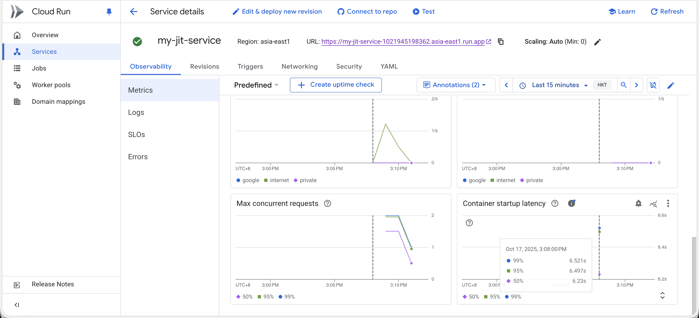
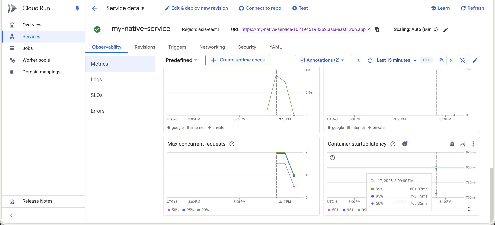

id: spring-native-workshop-lab1
author: Sean Chen
summary: Spring Native Workshop - 學習如何建置和部署 Spring Native 應用程式到 Google Cloud Run
categories: spring,java,native,cloud
environments: Web
status: Draft

# Spring Native Workshop

## 概述
Duration: 0:01:00

### 您將學到什麼

在本實驗中，您將學習：

* 如何使用 Spring Initializr 建立 Spring Boot 專案
* 如何配置 Spring Native 相關設定
* 如何建置 JIT 和 Native 映像檔
* 如何部署應用程式到 Google Cloud Run
* JIT 與 Native 映像檔的效能比較

### 先決條件

* 基本的 Java 和 Spring Boot 知識
* 已安裝 Docker
* 已安裝 Google Cloud SDK (gcloud)
* 已設定好 Google Cloud 專案

Positive
: 建議使用 **Google Cloud Shell** 進行本實驗！Cloud Shell 已預先安裝所有必要工具（Docker、gcloud、Java 等），可以立即開始，無需在本地環境安裝任何軟體。

## 建立 Spring Boot 專案
Duration: 0:01:00

### 建立專案

我們會從 start.spring.io 取得應用程式：

```bash
curl https://start.spring.io/starter.zip -d dependencies=web \
           -d javaVersion=11 \
           -d bootVersion=3.4.0 -o io-native-starter.zip
```

這個指令會下載一個包含 Spring Web 依賴的專案，使用 Java 11 和 Spring Boot 3.4.0 版本。

### 解壓縮專案

```bash
unzip io-native-starter.zip
```

Positive
: 專案已成功建立！接下來我們要配置 Spring Native 相關設定。

## 配置 Gradle 建置檔案
Duration: 0:05:00

### 1. 加入 AOT 外掛程式

在 `build.gradle` 檔案的 `plugins` 區塊中加入 Spring AOT (Ahead-of-Time) 編譯外掛程式：

```java
plugins {
  id 'org.graalvm.buildtools.native' version '0.10.1'
}
```

**作用：** 這個外掛程式會預先處理您的 Spring 應用程式，分析程式碼並產生原生映像檔所需的設定檔。

**目的：** 顯著提升原生映像檔的相容性、啟動速度並減少記憶體佔用。這是建置 Spring Native 應用程式的關鍵步驟。

### 2. 加入 Spring Release 存放區

在 `build.gradle` 檔案的 `repositories` 區塊中加入：

```java
repositories {
  mavenCentral()
  maven { url 'https://repo.spring.io/release' }
}
```

**作用：** 告訴 Gradle 一個新的可以下載套件的倉庫地址。

**目的：** Spring Native 相關的套件是實驗性功能，它們放在 Spring 自己的 release 倉庫裡。不加上這行，Gradle 會因為找不到 AOT 外掛程式而報錯。

### 3. 配置原生映像檔建置設定

在 `build.gradle` 檔案中加入 `bootBuildImage` 設定：

```java
bootBuildImage {
  builder = 'paketobuildpacks/builder-jammy-base:latest'
  environment = ['BP_NATIVE_IMAGE': 'true']
}
```

**作用：** 這一段是針對 `bootBuildImage` 這個 Gradle 任務的專門設定。

**目的：**

* `builder = 'paketobuildpacks/builder-jammy-base:latest'`: 使用 Paketo Buildpacks 的 jammy-base 建置器來建立 Docker 映像檔。這是一個輕量級的基礎映像檔，可以讓最終產生的 Docker 映像檔體積更小，也更安全。
* `environment = ['BP_NATIVE_IMAGE': 'true']`: 設定環境變數告訴 Buildpacks 要建置 Spring Native 原生映像檔，而不是傳統的 JVM 應用程式。

### 4. 配置 settings.gradle

在 `settings.gradle` 檔案中加入：

```java
pluginManagement {
  repositories {
	maven { url 'https://repo.spring.io/release' }
	gradlePluginPortal()
  }
}
```

Positive
: 所有配置都完成了！這些設定共同協作，確保您的 Gradle 專案能夠找到並使用 Spring Native 工具，在建置時觸發 AOT 處理，並最終產生一個最佳化的原生 Docker 映像檔。

## 建置映像檔
Duration: 0:05:00

### 建置 Docker 映像檔

使用以下指令建置 Docker 映像檔：

```bash
./gradlew bootBuildImage
```

這個指令會建置一個包含原生映像檔的 Docker 容器。建置過程可能需要幾分鐘時間。

### 驗證映像檔

建置完成後，檢查產生的 Docker 映像檔：

```bash
docker images demo
```

您應該會看到一個名為 `demo` 的映像檔，標籤為 `0.0.1-SNAPSHOT`。

Positive
: 恭喜！您已經成功建置了 Spring Native 映像檔。

## 部署到 Google Cloud Run
Duration: 0:05:00

### 設定專案變數

首先，取得您的 Google Cloud 專案 ID：

```bash
export PROJECT_ID=$(gcloud config list --format 'value(core.project)')
```

### 部署 JIT 版本

#### 標記映像檔

```bash
docker tag demo:0.0.1-SNAPSHOT asia-east1-docker.pkg.dev/$PROJECT_ID/jit-image-docker-repo/jit-image:v1
```

#### 推送映像檔到 Artifact Registry

```bash
docker push asia-east1-docker.pkg.dev/$PROJECT_ID/jit-image-docker-repo/jit-image:v1
```

#### 部署到 Cloud Run

```bash
gcloud run deploy my-jit-service \
  --image asia-east1-docker.pkg.dev/$PROJECT_ID/jit-image-docker-repo/jit-image:v1 \
  --region asia-east1 \
  --memory=1Gi \
  --allow-unauthenticated
```

### 部署 Native 版本

#### 標記映像檔

```bash
docker tag demo:0.0.1-SNAPSHOT asia-east1-docker.pkg.dev/$PROJECT_ID/native-image-docker-repo/native-image:v1
```

#### 推送映像檔到 Artifact Registry

```bash
docker push asia-east1-docker.pkg.dev/$PROJECT_ID/native-image-docker-repo/native-image:v1
```

#### 部署到 Cloud Run

```bash
gcloud run deploy my-native-service \
  --image asia-east1-docker.pkg.dev/$PROJECT_ID/native-image-docker-repo/native-image:v1 \
  --region asia-east1 \
  --memory=1Gi \
  --allow-unauthenticated
```

Positive
: 兩個版本都已成功部署到 Cloud Run！您可以在 Google Cloud Console 查看服務狀態和取得服務 URL。

## 效能比較
Duration: 0:02:00

### 比較指標

部署完成後，您可以比較 JIT 和 Native 版本在以下方面的差異：

* **啟動時間**: Native 映像檔通常啟動速度快 10-100 倍
* **記憶體使用量**: Native 映像檔記憶體佔用通常減少 50-80%
* **映像檔大小**: Native 映像檔通常更小
* **冷啟動延遲**: Native 版本在 Cloud Run 上的冷啟動延遲顯著降低

### Cloud Run 冷啟動時間對照

#### JIT 版本冷啟動時間



#### Native 版本冷啟動時間



從上面兩張圖可以清楚看到，Native 版本的冷啟動時間顯著低於 JIT 版本，這對於 Cloud Run 這類 serverless 平台特別重要。

### 測試服務

使用 Cloud Run 提供的 URL 測試兩個服務，觀察它們的回應時間差異。

Negative
: 注意：Native 映像檔的建置時間會比 JIT 版本長很多，這是正常現象。權衡建置時間與執行效能是選擇使用 Native 映像檔的考量之一。

## 總結
Duration: 0:01:00

### 您學到了什麼

恭喜！您已經完成了 Spring Native Workshop。在本實驗中，您學習了：

* ✓ 如何配置 Spring Native 專案
* ✓ 理解 AOT 編譯和相關 Gradle 設定的用途
* ✓ 如何建置 Native 映像檔
* ✓ 如何部署應用程式到 Google Cloud Run
* ✓ JIT 與 Native 映像檔的差異

### 後續步驟

* 探索更多 Spring Native 功能
* 嘗試在更複雜的應用程式中使用 Native 映像檔
* 了解 GraalVM 的其他功能

### 參考資源

* [Spring Native 官方文件](https://docs.spring.io/spring-native/docs/current/reference/htmlsingle/)
* [GraalVM 官網](https://www.graalvm.org/)
* [Google Cloud Run 文件](https://cloud.google.com/run/docs)
